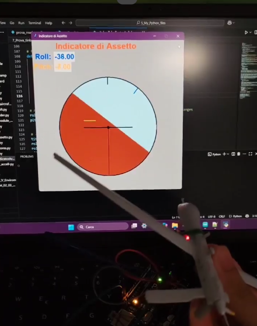

# Arduino-Python-Artificial-Horizon

A small project combining **Arduino**, **Python**, and an **accelerometer** to recreate a simple **aircraft attitude indicator**.

---

## Overview

I created this project as a **practice exercise** to improve my **Arduino and Python** skills, and decided to share it here on GitHub.  

An Arduino board reads **pitch** and **roll** data from an **MPU6050 accelerometer** and sends it to a PC via **serial communication**.  
A Python script (using **PySerial** and **Tkinter**) displays the data in real time as a basic **artificial horizon**.

To make things more fun and visual, I attached the accelerometer to an **RQ-1 Predator model** using a rubber band 😄  
It turned out to be a great way to connect hardware and software while practicing embedded systems and data visualization!

🎥 **Video demo:** [YouTube](https://youtube.com/shorts/nl1kET7p0yA?si=YtbqkHNL75Do1jj0)

---

## File Details

- **Attitude_Indicator_Only.py**  
  A standalone Python script that contains only the **attitude indicator** made with Tkinter.  
  It can be run **without the Arduino**.  
  In the Tkinter window, you can manually input **pitch**, **roll**, and **heading** values to test how the indicators work.

- **Arduino_live_att_indicat.py**  
  A Python script that must be used with the Arduino connected to the computer.  
  It reads **pitch** and **roll** values from the serial communication with Arduino and plots them in the **artificial horizon** recreated with Tkinter, as in the previous script.

- **MPU_pitch_roll_Pyt_comm.ino**  
  The Arduino sketch created with the Arduino IDE.  
  It reads acceleration data from the MPU6050, calculates **pitch** and **roll** angles, and sends them via **serial communication**.  
  Credits for this code go to **Carbon Aeronautics**, I recommend watching their tutorial to better understand it:  
  [https://youtu.be/7VW_XVbtu9k?si=yDsCyBnuSdUbkwY7](https://youtu.be/7VW_XVbtu9k?si=yDsCyBnuSdUbkwY7)

---

## Notes and Suggestions

- Make sure to **mount the accelerometer in the correct orientation**, or adjust the **sign of the angles** accordingly, following the aeronautical convention:  
  - **Positive Roll → Right wing down**  
  - **Positive Pitch → Nose up**

- Although a **heading indicator** is included in the Tkinter GUI, it is **not used** in the live plotting script, since a **magnetometer** would be required to measure heading in real time.

- Some comments in the code may still be in Italian (I’m Italian!), I might have forgotten to translate all of them 😅

---

## Components

- Arduino Uno (or compatible board)  
- Accelerometer (e.g., MPU6050)  
- USB cable  
- Computer with Python 3.x  

---

## Software & Libraries

### Arduino
- [Arduino IDE](https://www.arduino.cc/en/software)

### Python
- [Python 3.x](https://www.python.org/)
- Required libraries:  tkinter, Pyserial, numpy, math
